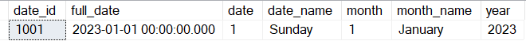
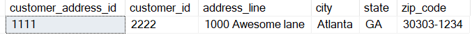
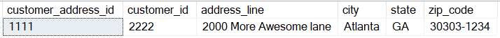
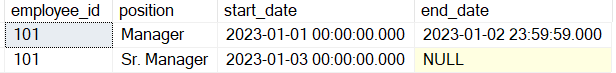

Data stored in a database can change over time. To address the change in data that is stored in a Dimension table, we came up with a concept "Slowly Changing Dimension" (SCD). There are many types of SCD

- SCD 0
- SCD 1
- SCD 2
- SCD 3

### SCD 0 - Original record remains unchanged
In this type, the data which was inserted in the record when it was created, will stay as-is over its lifetime.

**Example**: A date dimension table. When a day is inserted as "01-01-2023", the information in that record will not change in its lifetime.

### SCD 1 - Overwrite changes
When a data element changes in an existing record, that cell will be updated with its new value.

**Example**: When an Address line is changed for a Customer, its new value will be updated on top of existing value.

Before:

After:

### SCD 3 - Add a new record for new value
When a data element changes in an existing record, a new record will be added instead of updating in-place. This method preserves history of the record and curent value at the same time.

**Example**: When an Employee's position changed from Manager to Sr.Manager

